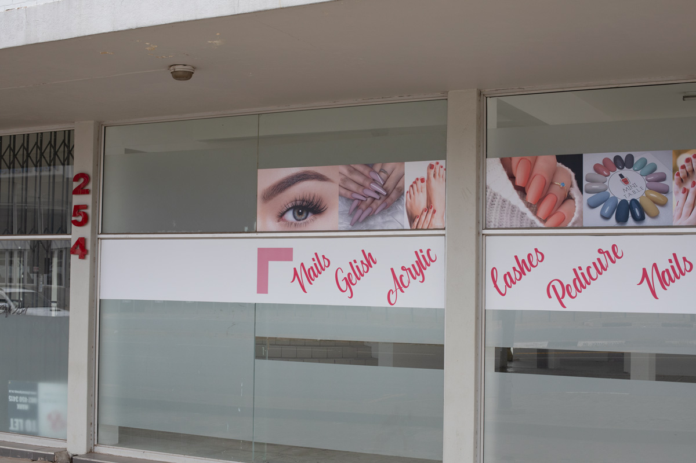

Beyers Naudé is like a crumpled classifieds newspaper section. When everything stands out and nothing stands out. An answer that’s come out of the negotiation between safety and commerce. I didn’t realise this road would be such a feature of my daily commute and such a feature of suburban life here.

> Christiaan Frederick Beyers Naudé was a South African cleric,
> theologian and the leading Afrikaner anti-apartheid activist.

[Wikipedia](https://en.wikipedia.org/wiki/Beyers_Naud%C3%A9).

