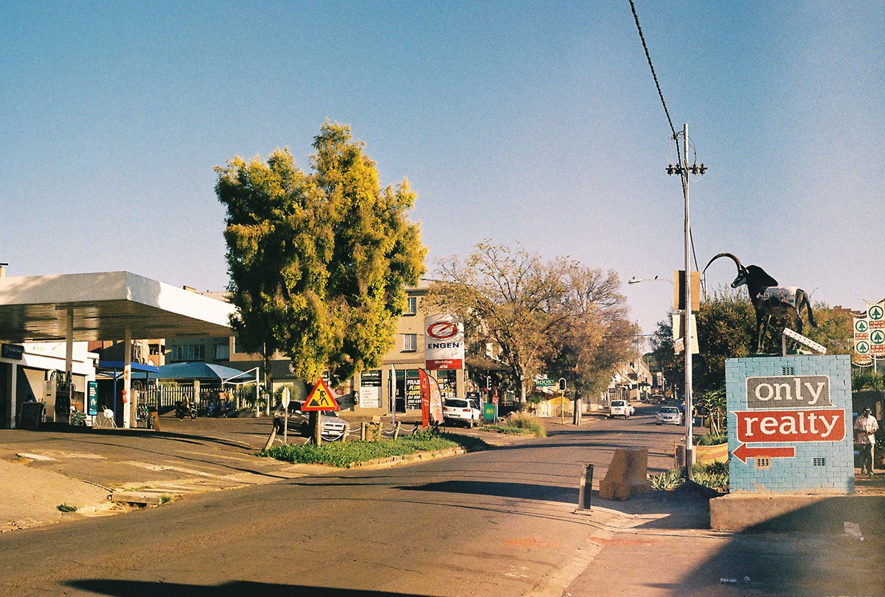

### Joburg. I get it now. It’s about dominating the potholes. The highway culture. It’s a car city. A mall city. A brand city.

This place is vicious. It’s blatant. A battery. Which is a way of storing power. Where is the power we ask during the loadshedding?

I hear talk about the EFF or similar struggle narratives. We’re in the political climate of chaos which benefits a few with muddy relationships with morals. Leadership crisis like the KING IV management principles would say. I wouldn’t say compare it to Cape Town. It’s on it’s own. It exists. Check out the blue choked arteries of the national road naming system. Everything N’s here. N1. N2. N3. Architectural styles and systems a blend of genetics as multifaceted as its inhabitants. People floating in this support system waiting for basic services. Racism still hangs in the gutters.

Currently reading a mybroadband article, [What to do if a South African cop asks you for a bribe.](https://mybroadband.co.za/news/motoring/320431-what-to-do-if-a-south-african-cop-asks-you-for-a-bribe.html)

Thinking about a new car. Want my material self to expand. Joburg is an interesting urban experiment. Kind of tapestry of land use. Containing the richest square mile in Africa. Who said that? The corporate is banal. People together create dynamical political tension. The tension of self in labour in the acquisition and feelings of transforming time into a bank statement. A mixture of Foucault and a tumble drier handbook. The humanity of car parks and material self.

I’m at a braai in Parkview. The clever gays are here. Doing cheat days. I need more lessons in tolerance, accept and inclusion. We talk about the value tornado and decision trees. MBA types complain about corporate female positive conferences with guest speakers who insult the core values of the effort. Being English I feel seen as a cultural outsider.

I spend my time in water and tiles. Sharp chilly pools. Rinse and repeating everyday as a mental routine. Outside my office block there are the Flight Centre workers in Navy corporate uniforms playing U2’s With or Without You to celebrate Fridays. That’s an acceptable point of rebellion in a carpark. 4x4’s with saving Rhino stickers. There are drones. There's Xenophobia. Zulu taxi driver gangs. I heard about the ‘shoulder Bar’ in the Kasi. Kids with wheelbarrows take you home after you are motherless drunk for just R15.

The history keeps me interested. Rushing to dig up gold and now pavements dug up by Vumatel. A constant war against finality. There are many layers of makeup. Paint the building grey and fix kitchen fixtures. Repaint the bathroom.

