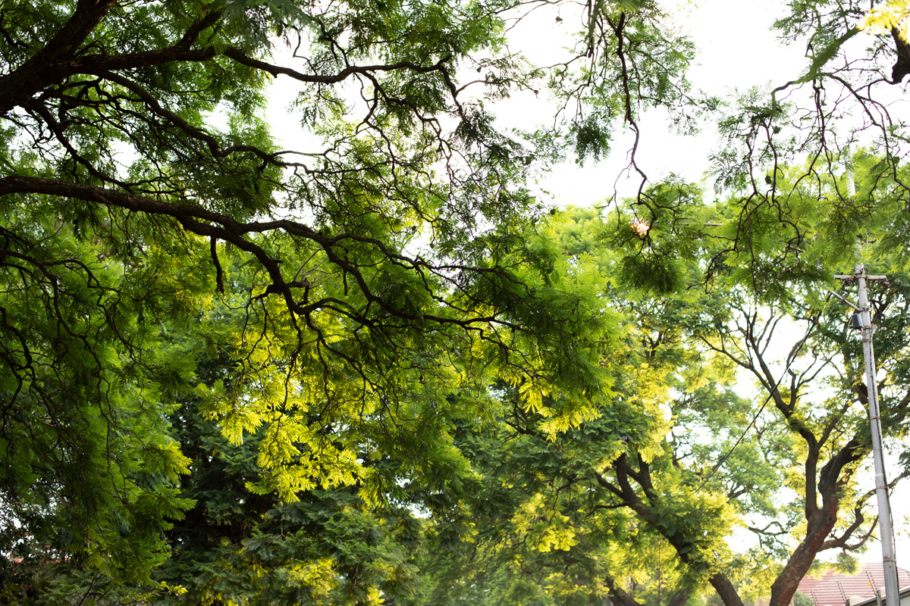
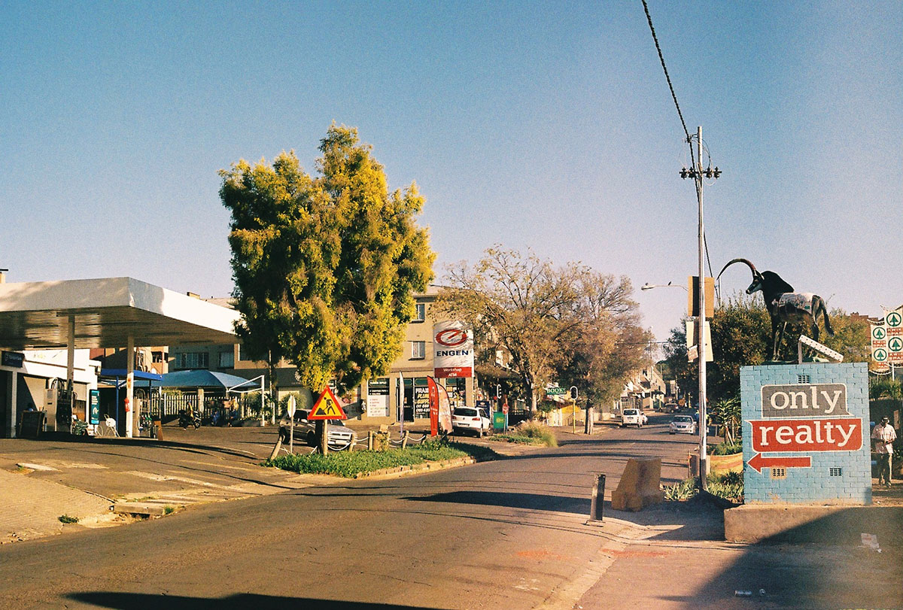
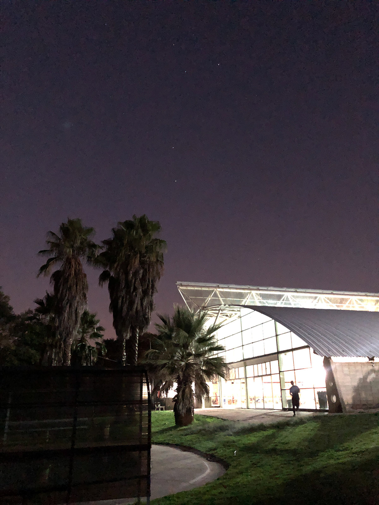

Established. Real estatey. Lots of trees. I listen to the birds at 3 in the morning. Many different ways of seeing this city. People have been here all their lives so I can’t compare material or social capital. There’s a hint of a café culture between the Argentinean, The Whippet and now Yield coffee.

